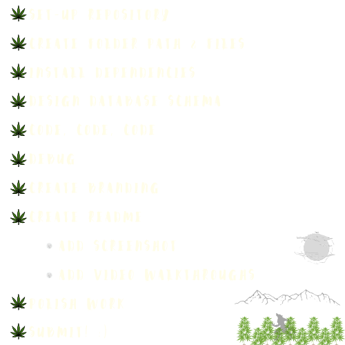

<p align="center">

</p>

[](https://opensource.org/licenses/MIT)
[](https://nodejs.org/en)
[](http://badge.fury.io/js/inquirer)
[](https://www.mysql.com)

[](https://canva.com)
[](https://canva.com)
[](https://www.npmjs.com/package/nodemon)

[](https://www.npmjs.com/package/chalk)
[](https://canva.com)


### 

  - [OVERVIEW](#overview)
    - [user story](#user-story)
    - [acceptance criteria](#acceptance-criteria)
    - [the hairy list](#hairy-list)
  - [INSTALLATION](#installation)
  - [USAGE](#usage)
    - [screenshot](#screenshot)
    - [demo](#demo)
  - [TESTING](#testing)
  - [SOURCES](#sources)
  - [LICENSE](#license)
  - [LINKS](#links)
  - [CONNECT](#connect)

### 
The `WEREWOLF WEED Employee Database` is a command-line application that manages WEREWOLF WEED'S employee database by using [Node.js](https://nodejs.org/en), [Inquirer](https://www.npmjs.com/package/inquirer), and [MySQL](https://www.mysql.com).

* [MySQL2 package](https://www.npmjs.com/package/mysql2) to connect to `WEREWOLF WEED'S` MySQL *database* and perform *queries*.
* [Inquirer package](https://www.npmjs.com/package/inquirer/v/8.2.4) to interact with the user via the command-line.

### 


### 


### 



### 

The application is invoked using the following commands:

*Clone the repository in your local development enviorment.*

```
git clone https://github.com/christiecamp/werewolf-weed.git
```

**Update *connection.js* with your information**

*Navigate to the command line and input:*

```javascript
npm i :: inquirer@8.2.4, --save mysql2, dotenv --save, --save sequelize, -g nodemon --save-dev, console-table-printer
```
```javascript
mysql -u root -p
```
```mysql
SOURCE lib/db/schema.sql;
SOURCE lib/db/seeds.sql;
quit
```
```javascript
node server
```

### 

**INSTRUCTIONS:**

1. Open the Integrated Terminal and input - node server.

2. Interact with WEREWOLF WEED's database by selecting the below prompts:
      * view departments
      * view roles
      * view employees
      * add department
      * add role
      * update employee role
      * view employee by manager
      * update employee manager
      * delete department
      * delete role
      * delete employee
      * view total utilized budget by department


### 


### 


### 


### 

Here's a list of technologies used:

1. [Node.js](https://nodejs.org/en) - is an open-source, cross-platform JavaScript runtime environment.

2. [Inquirer](https://www.npmjs.com/package/inquirer/v/8.2.4) - the NPM package that provides an easy way to capture user input in your Node. js command line interface applications.

3. [MySQL2](https://www.npmjs.com/package/mysql2) - MySQL is a relational database management system based on SQL – Structured Query Language.

4. [Dotenv](https://www.npmjs.com/package/dotenv) - a zero-dependency module that loads environment variables from a .env file into `process.env`.

5. [Sequelize](https://sequelize.org/) - a Node.js based `Object Relational Mapper` that makes it easy to work with **MySQL databases**. An *Object Relational Mapper* performs functions like handling database records by representing the data as objects.

6. [Nodemon](https://www.npmjs.com/package/nodemon) - a Node.js tool that helps develop applications by automatically restarting the node application when file changes in the directory are detected.

7. [Chalk](https://www.npmjs.com/package/chalk) - a Node.js tool that helps develop applications by automatically restarting the node application when file changes in the directory are detected.

8. [Console Table Printer](https://www.npmjs.com/package/console-table-printer) - a Node.js tool that prints simple tables.

### 

[MIT License](./LICENSE)

### 

[GitHub Repository](https://github.com/christiecamp/werewolf-weed)

[Video Demo](https://drive.google.com/file/d/1-PaAt5Gt47rRBaM1NkJ70OeOQYEGAyDj/view?usp=sharing)

### 

[](https://github.com/christiecamp/bear-taker)

<a href="mailto:christiecamphoto@gmail.com">

</a>


<p align="center">
<a href="https://www.christiecamp.com"></a>
</p>